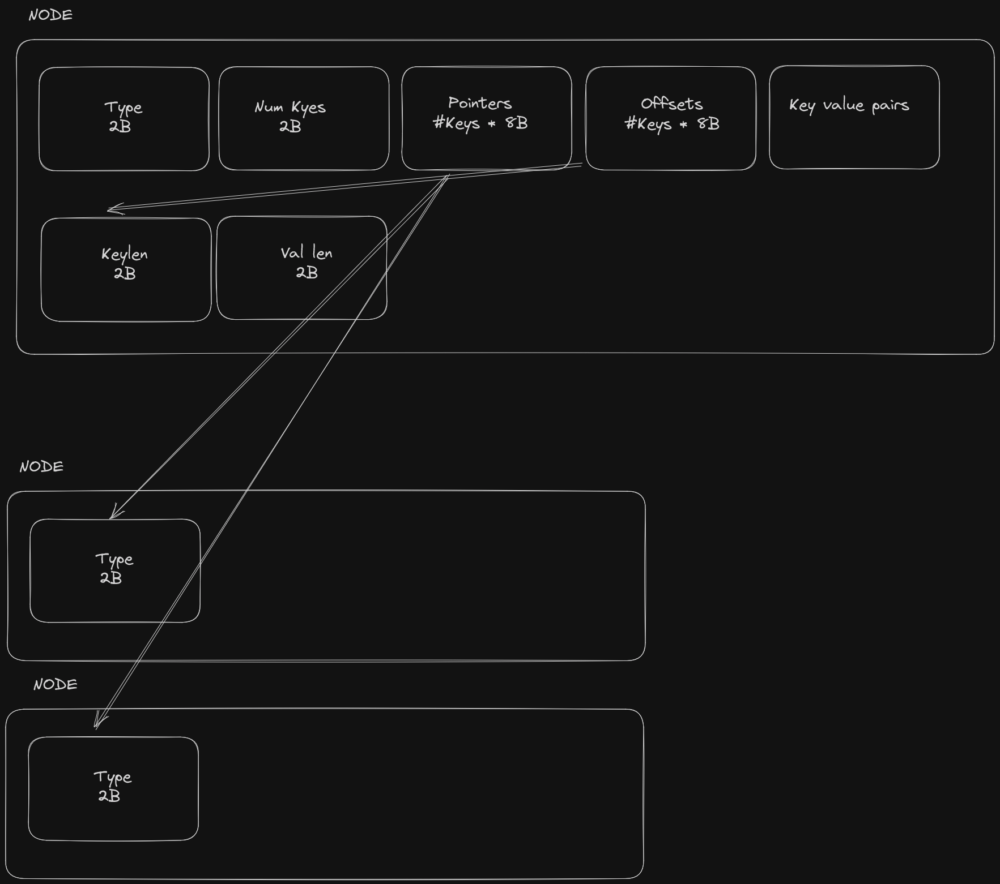

# Squicel
Simple database implementation using B(+)Trees.

# Node structure

# TODO
- [x] Define Btree and Bnode structures
- [ ] Add node to tree
- [ ] Rebalance tree
- [ ] Delete from tree
- [ ] Persist data to disk
- [ ] Simple SQL parser
